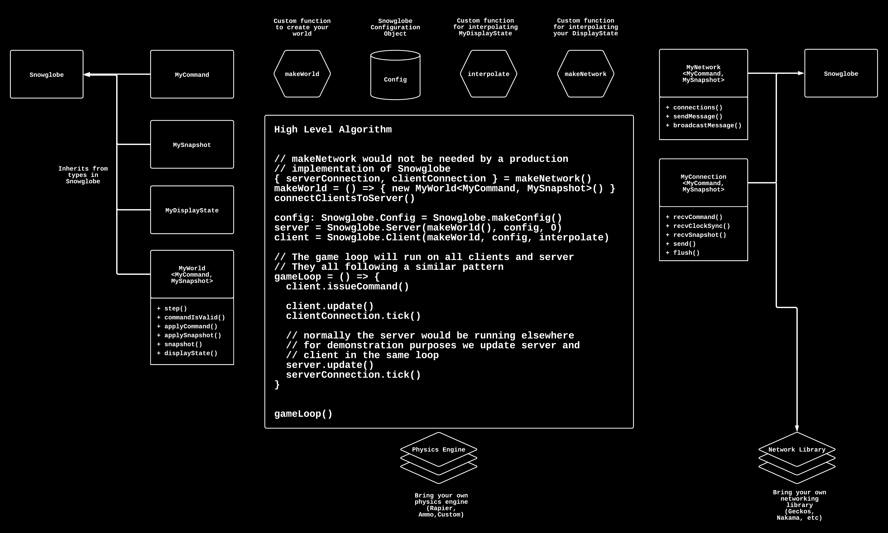

# Snowglobe ☃️

An experimental TypeScript port of the Rust multiplayer game networking library [CrystalOrb](https://github.com/ErnWong/crystalorb) by [Ernest Wong](https://ernestwong.nz/).

Snowglobe is under active development and will break often. The API/implementation will eventually diverge from CrystalOrb due to particular characteristics of JavaScript, but for now it remains virtually 1:1.


## Install

Install snowglobe using NPM:

```sh
npm i @hastearcade/snowglobe
```

## About

Snowglobe is an orchestrator designed to solve state syncronization between a game server and a set of game clients. In a perfect network, maintaining the state of your game world between a set of parties would simply be a matter of applying updates to the game world to all parties simultaneously, but we do not live in a perfect world.

The networking and physics libraries required to build a game or simulation are outside the scope of Snowglobe. Snowglobe will orchestrate the game sync algorithm, but to build a full game the developer will need to utilize networking libraries like [Geckos.io](https://github.com/geckosio/geckos.io) and physics libraries like [Rapier](https://rapier.rs/).

The problem becomes non-trivial when layering in latency, bad actors, and disconnects. Glenn Fiedler describes the problems and solutions [here](https://gafferongames.com/post/introduction_to_networked_physics/).

Snowglobe assists in solving the difficulty of networking physics for Typescript based games or simulations by implementing Client-side prediction, Server reconciliation, and Display State interpolation. Ernest Wong and the Crystal Orb team did an excellent job describing the solution as:

- Client-side prediction. Clients immediately apply their local input to their simulation before waiting for the server, so that the player's inputs feel responsive.
- Server reconciliation. The Server runs a delayed, authoritative version of the simulation, and periodically sends authoritative snapshots to each client. Since the server's snapshots represent an earlier simulation frame, each client fast-forwards the snapshot they receive until it matches the same timestamp as what's being shown on screen. Once the timestamps match, clients smoothly blend their states into the snapshot states.
- Display state interpolation. The simulation can run at a different time-step from the render framerate, and the client will automatically interpolate between the two simulation frames to get the render display state.

## Quick Start

Below is a (non-comprehensive) sample of the ported CrystalOrb API. This example is missing critical features like a game loop, networking, serialization, etc.

See the Code Architecture section below for a more detailed description of the Snowglobe types and integration points.

```ts
import * as Snowglobe from 'snowglobe'

type MyCommand = Snowglobe.Command & { kind: 'jump' }

type MySnapshot = Snowglobe.Snapshot & {
  position: number
  velocity: number
}

type MyDisplayState = Snowglobe.DisplayState & {
  position: number
  velocity: number
}

function interpolate(state1: MyDisplayState, state2: MyDisplayState, t: number) {
  return {
    // simple lerp function
    position: (1 - t) * state1.position + t * state2.position,
    velocity: (1 - t) * state1.velocity + t * state2.velocity
  }
}

class Net implements Snowglobe.NetworkResource {
  // implement methods like send(), connections(), etc.
}

class World implements Snowglobe.World {
  // implement step(), applyCommand(), applySnapshot(), etc.
}

const config: Snowglobe.Config = Snowglobe.makeConfig()
const makeWorld = () => new World()
const client = new Client(makeWorld, config, interpolate)
const server = new Server(makeWorld(), config, 0)
```

## Examples

```sh
npm run example:standalone # starter example
npm run example:demo # mock client/server demo
```

## Code Architecture

The following diagram shows a visual representation of the code architecture. The diagram is meant to be understood by reading alongside `examples/standalone.ts`.



The typical game or simulation will have a game loop that runs at 60 fps. Snowglobe is responsible for facilitating client side prediction, server reconciliation, and display state interpolation. This helps solve some of the challenges with networked games and physics. Snowglobe provides the following types to be inherited from in order to utilize Snowglobe's toolset.

`World`: All games start with a representation of a World. To utilize Snowglobe you will need to inherit from `Snowglobe.World` and implement the `step`, `commandIsValid`, `applyCommand`, `applySnapshot`, `snapshot`, and `displayState` functionality. Please send the standalone implementation of `MyWorld` for more details.

`DisplayState`: While every game has a World, not every game needs to display the entire world to the player at one time. You might have many objects that need to be culled from the scene. Thus, Snowglobe assumes there is an abstraction of the rendered state called `DisplayState`. As a developer, you must create a custom `MyDisplayState` class that inherits from `Snowglobe.DisplayState`. This display state should represent the minimal amount of state necessary to render to the screen.

`Snapshot`: Snapshots are points in time pictures of a world. All data is frozen and utilized by the Snowglobe system to interpolate state changes between the Client and Server. A snapshot is the minimal data object representing the entire physics simulation. The goal should be to keep the size of your snapshots as small as possible to reduce the load on the network. `MySnapshot` could have the same properties as `MyWorld`, but it is unlikely in a real world example.

`Command`: A Snowglobe command represents a player or server issuing an instruction to the game world. This could be moving left or spawning new NPCS. The game world will need to have the command processed which will result in a change of world state. This world state change will then need to be syncronized amongst the other clients. The developer will need to implement a `MyCommand` type that inherits from `Command`. This type should have all available commands that can be used by the system. In addition, the `commandIsValid` function of `MyWorld` will need to ensure that any command sent to the world is valid. For example, there may be certain commands that can only be processed by the server but not the Client

Once you have implemented `MyWorld`, `MyDisplayState`, `MySnapshot`, and `MyCommand` then Snowglobe will need to be incorporated into your game loop.

The game loop for `standalone.ts` has more code to facilitate the mock network needed than the actual Snowglobe integration. The primary integrations for Snowglobe are as follows:

1. Create a Snowglobe Server or Client: `const client1 = new Snowglobe.Client(makeWorld, config, interpolate)`
2. Issue commands:

```typescript
client1Stage.ready.issueCommand(
  {
    kind: 'accelerate',
    clone() {
      return { ...this }
    }
  },
  client1Net
)
```

3. Retrieve display state: `client2DisplayState = client2Stage.ready.displayState()`
4. Update Client/Server: `client1.update(deltaSeconds, secondsSinceStartup, client1Net)`

# TODO

1. Make lag compensation optional
2. Improve ownership management of entities and make it easier on the consumer of the library
3. Document each setting in makeconfig so consumers know what impact it has
4. Refactor Timestamps back to use Symbols, but make sure they work over real network/there is documentation
5. Move geckos network into snowglobe as a plugin
6. Update README with new lag compensation changes
7. Fix build process to work with next/auto deploy with semantic versioning
